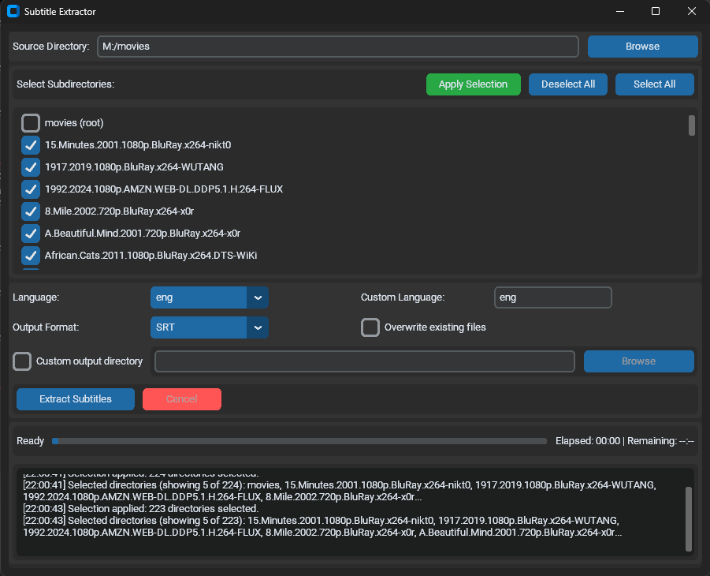

# Subtitle Extractor

A powerful and user-friendly tool to extract subtitles from video files using FFmpeg.

## Features

- Extract subtitles from multiple video files with a single click
- Support for various subtitle formats (SRT, ASS, VobSub, WebVTT)
- Batch processing with directory and subdirectory selection
- Custom output directory option
- Clear progress tracking with time estimation
- Detailed logging and extraction statistics

## Screenshot



*The Subtitle Extractor interface showing the directory selection and subdirectory list*

## Requirements

- Python 3.7+
- FFmpeg and FFprobe installed and in your system PATH
- CustomTkinter library

## Installation

1. Clone the repository:
   ```
   git clone https://github.com/MoshikoKar/subtitle-extractor.git
   ```

2. Install dependencies:
   ```
   pip install customtkinter
   ```

3. Ensure FFmpeg is installed:
   - Windows: Download from [FFmpeg.org](https://ffmpeg.org/download.html) and add to PATH
   - macOS: `brew install ffmpeg`
   - Linux: `sudo apt install ffmpeg`

## Usage

1. Run the application:
   ```
   python extract_subtitles.py
   ```

2. Select your source directory containing video files
3. Choose the subdirectories you want to process and click "Apply Selection"
4. Select the subtitle language and output format
5. Click "Extract Subtitles" to begin the extraction process

## Language Support

The tool supports extracting subtitles in different languages based on the language codes in the video files. Common language codes include:

- `eng` - English
- `heb` - Hebrew
- `und` - Undefined/Unknown

You can also enter custom language codes in the "Custom Language" field.

## Output Formats

The following subtitle formats are supported:

- **SRT** (SubRip Text) - Most widely compatible format
- **ASS** (Advanced SubStation Alpha) - Supports advanced styling
- **VobSub** - DVD subtitle format (.idx/.sub)
- **WebVTT** - Web Video Text Tracks format

## Contributing

Contributions are welcome! Please feel free to submit a Pull Request.

## License

This project is licensed under the MIT License - see the LICENSE file for details.

## Author

[MoshikoKar](https://github.com/MoshikoKar)
